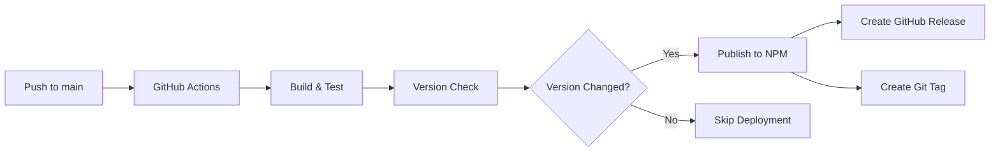

# AIM Guard MCP

🛡️ **AIM MCP Server :: Guard and Protect your MCPs & AI Chatting**

A Model Context Protocol (MCP) server that provides AI-powered content analysis and security tools. This server includes a simple hello world tool for testing and a powerful text guard tool for analyzing content safety using AIM Intelligence API.

## Features

- 🌍 **Hello World Tool**: Simple greeting and demonstration tool for testing MCP functionality
- 🛡️ **Text Guard Analysis**: Analyze text content for harmful or inappropriate content using AI
- ⚡ **Fast & Lightweight**: Built with TypeScript and Zod validation
- 🔧 **Easy Integration**: Works with any MCP-compatible AI assistant
- 🔗 **API Integration**: Connects to AIM Intelligence API for advanced content analysis

## Installation

### NPX (Recommended)

```bash
npx aim-guard-mcp
```

### Global Installation

```bash
npm install -g aim-guard-mcp
aim-guard-mcp
```

### Local Installation

```bash
npm install aim-guard-mcp
```

## Usage

### As MCP Server

Add to your MCP client configuration:

```json
{
  "servers": {
    "aim-guard": {
      "type": "stdio",
      "command": "npx",
      "args": ["aim-guard-mcp"]
    }
  }
}
```

### Testing the Tools

#### Test Hello World Tool

```bash
# This will return a personalized greeting with timestamp
{
  "name": "aim-hello-world",
  "arguments": {
    "name": "Alice"
  }
}
```

#### Test Text Guard

```bash
# This will analyze the text for harmful content
{
  "name": "aim-text-guard",
  "arguments": {
    "text": "This is a sample text to analyze for safety."
  }
}
```

### Available Tools

#### 1. `aim-hello-world`

A simple hello world tool for testing MCP functionality and demonstrating basic features.

```json
{
  "name": "aim-hello-world",
  "arguments": {
    "name": "Your Name" // Optional: user name for personalized greeting
  }
}
```

**Response**: Returns a greeting message with current timestamp and basic functionality demonstration.

#### 2. `aim-text-guard`

Analyze text content for harmful or inappropriate content using AIM Intelligence API.

```json
{
  "name": "aim-text-guard",
  "arguments": {
    "text": "Text content to analyze for harmful content"
  }
}
```

**Features**:

- Real-time content analysis
- Harmful content detection
- Detailed analysis results in JSON format
- Error handling with informative messages
- Timestamp tracking for analysis requests

## Development

```bash
# Clone the repository
git clone https://github.com/AIM-Intelligence/AIM-MCP.git
cd AIM-MCP

# Install dependencies
pnpm install

# Build the project
pnpm run build

# Run in development mode
pnpm run dev

# Run tests
pnpm test
```

## Deployment

This project uses automated CI/CD pipeline for seamless deployment to NPM.

### Automatic Deployment

When you push to the `main` branch, GitHub Actions will automatically:

1. **Build and Test**: Compile TypeScript and run tests
2. **Version Check**: Compare current version with published version
3. **Publish to NPM**: Automatically publish if version has changed
4. **Create Release**: Generate GitHub release with version tag

### Manual Version Management

```bash
# Bump patch version (1.0.0 -> 1.0.1)
pnpm run release:patch

# Bump minor version (1.0.0 -> 1.1.0)
pnpm run release:minor

# Bump major version (1.0.0 -> 2.0.0)
pnpm run release:major
```

### Setting up NPM Token

To enable automatic deployment, add your NPM token to GitHub Secrets:

1. Go to [npmjs.com](https://www.npmjs.com) and create an automation token
2. In your GitHub repository, go to Settings > Secrets and variables > Actions
3. Add a new secret named `NPM_TOKEN` with your NPM token value

### Deployment Workflow



## Contributing

1. Fork the repository
2. Create your feature branch (`git checkout -b feature/amazing-feature`)
3. Commit your changes (`git commit -m 'Add some amazing feature'`)
4. Push to the branch (`git push origin feature/amazing-feature`)
5. Open a Pull Request

## License

This project is licensed under the ISC License - see the [LICENSE](LICENSE) file for details.

## Support

- 📧 Email: support@aim-intelligence.com
- 🐛 Issues: [GitHub Issues](https://github.com/AIM-Intelligence/AIM-MCP/issues)
- 📖 Documentation: [GitHub Wiki](https://github.com/AIM-Intelligence/AIM-MCP/wiki)

---

Made with ❤️ by [AIM Intelligence](https://github.com/AIM-Intelligence)
